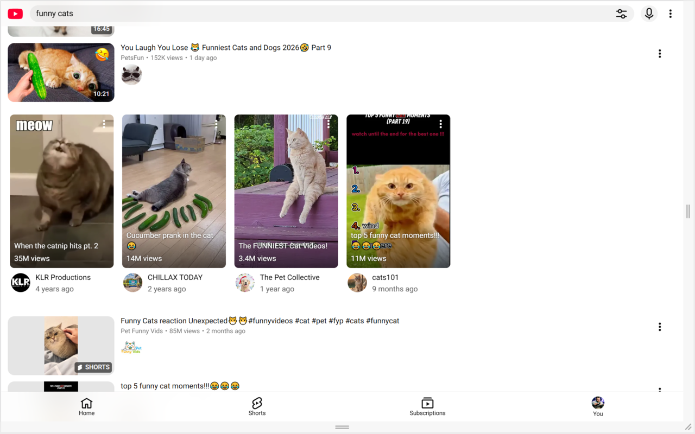

# youtube-no-shorts

Google chrome extension to hide short form content from Youtube.

## Install

Hopefully this will be available in the Chrome Extensions store soon. However, right now it is still under review. In the meantime, you can install by following these steps:

1. Download the zipped extesion [here](./youtube-no-shorts.zip)
2. Extract it somewhere on your computer
3. Go to [chrome://extensions](chrome://extensions)
4. Enable Developer Mode
5. Click Load unpacked and load the extracted folder
6. that's it! the extension is now added to your web browser!

## Before

## After

